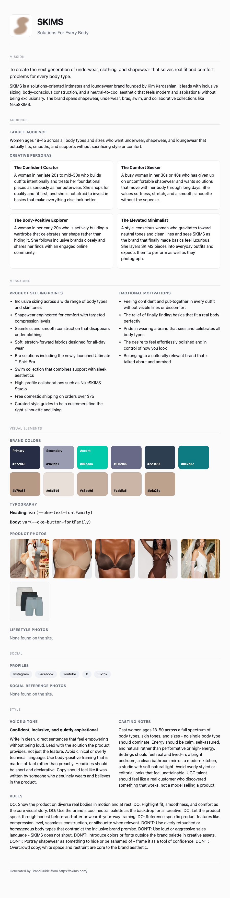

# BrandGuide

**Generate a complete brand guide from any website URL.** Point it at a site and
it scrapes the real logo, colors, fonts, copy, product photos, lifestyle photos,
social reference photos, and social links, then has Claude synthesize a
structured brand guide - voice, audience, personas, selling points, color system,
typography, casting notes, and rules. Outputs **JSON + HTML**. Bring your own key.

It is the upstream "step 1" of a marketing stack: the `brand-guide.json` it
produces feeds downstream tools (ad-creative generators, post writers, the
[HookForge](https://github.com/saraham18/HookForge) hook simulator).



---

## What it produces

A structured brand-memory schema, so guides are portable and easy to feed into
downstream tools:

| Group | Fields |
|---|---|
| **Mission** | `brand_name`, `tagline`, `mission`, `summary` |
| **Audience** | `target_audience`, `personas[{name, description}]` |
| **Messaging** | `selling_points[]`, `emotional_motivations[]` |
| **Visual** | `logo_path`, `primary_color`, `secondary_color`, `accent_color`, `color_palette[]`, `font_heading`, `font_body` |
| **Style** | `voice_tone`, `voice_notes`, `casting_notes`, `rules` |
| **Assets** | `assets[{kind, label, file_path}]` - product, lifestyle, and social reference photos, downloaded locally |
| **Social** | `social_links{}` - the brand's own profiles (instagram, tiktok, x, ...) |

Each run writes a per-project folder:

```
projects/<site>/
  brand-guide.json   # structured data (the source of truth)
  brand-guide.html   # polished, self-contained guide you can open or share
  logo.<ext>         # the site's real logo, downloaded
  assets/            # product / lifestyle / social reference photos
```

## How it works

1. **Scrape** (`scrape.py`) - fetch the page, pull title/description/copy, rank
   **logo candidates**, extract **colors** (greys de-prioritized) and **fonts**,
   classify **content images** (product / lifestyle / social) from JSON-LD product
   data and image context, and detect the brand's **social profiles**.
2. **Extract** (`extract.py`) - download the real logo and the classified photos;
   sample the logo's dominant palette with Pillow.
3. **Synthesize** (`brandguide.py`) - Claude infers the full guide from the
   signals, choosing primary/secondary/accent **from the detected colors** so the
   palette is real, not guessed. Output is sanitized (no emojis or em dashes).
4. **Render** (`render.py`) - emit a clean HTML brand guide with color swatches
   and photo galleries.

Every network and LLM call is **injectable**, so the whole pipeline is unit-tested
offline with fakes - no key, no network (`pytest -q` -> 13 passing).

## Install

```bash
git clone https://github.com/saraham18/BrandGuide.git
cd BrandGuide
pip install -e ".[all]"      # scraping works with just the base deps
cp .env.example .env         # add your ANTHROPIC_API_KEY
```

## Use

```bash
brandguide generate --url https://stripe.com
# -> projects/stripe-com/brand-guide.json + .html + logo + assets/

brandguide generate --url example.com --name my-project --out projects

# JS-heavy or client-rendered site? Render it with headless Chromium first so
# lazy-loaded product grids and feeds are captured (needs the render extra):
#   pip install -e ".[all]" && playwright install chromium
brandguide generate --url https://example.com --render
```

By default the scraper reads server-rendered HTML, which is fast and covers most
sites. `--render` loads the page in headless Chromium, lets it hydrate, and
scrolls to trigger lazy-loaded images before scraping - use it when a site
returns few product or lifestyle photos without it.

### Example data (real output from `stripe.com`)

```json
{
  "brand_name": "Stripe",
  "tagline": "Financial infrastructure to grow your revenue.",
  "voice_tone": "Precise, confident, and quietly ambitious.",
  "primary_color": "#533afd",
  "font_heading": "sohne-var",
  "personas": [{ "name": "The Ambitious Founder", "description": "..." }],
  "selling_points": ["135+ currencies and payment methods supported globally", "..."],
  "casting_notes": "Cast real-looking founders, engineers, and operators aged 25-45 ..."
}
```

## Configuration

Bring-your-own-key via `.env` (gitignored). See [`.env.example`](.env.example):
- `ANTHROPIC_API_KEY` - required
- `BRANDGUIDE_MODEL` - optional model override (default `claude-sonnet-4-6`)

## Contributing

Issues and PRs welcome. Good first additions: more image-classification
heuristics, pulling social reference photos via the Instagram Graph API, or extra
output formats.

## License

MIT (c) 2026 Sarah McLellan
